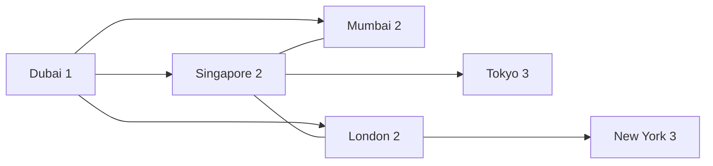
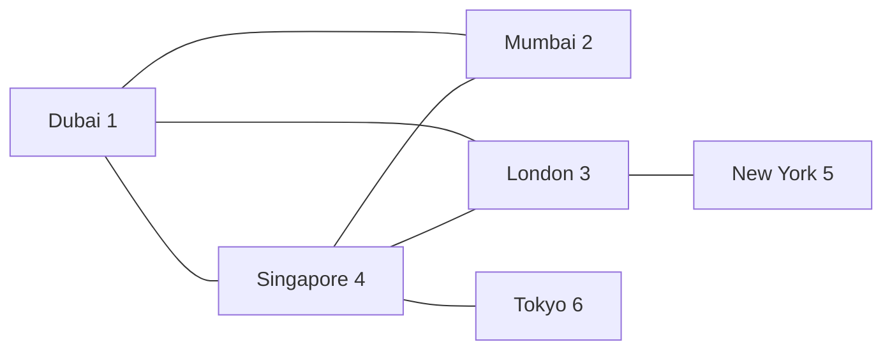

Developing web and mobile apps doesn't force engineering or product teams to reach out of typical Data Structures and Algorithms. But, everything which has a "logical flow" (workflow) can be represented as a State Machine. Before we delve into State Machines, we explore Graphs as a Data Structure, and build a State Machine as a followup.

<!-- truncate -->

### Representing a Graph

Standard mathematical notation for a graph **G** is **(V,E)**,where:

- V represents the set of vertices (also called nodes)
- E represents the set of edges (connections between vertices)

For example, in a simple graph representing friendships:

Lets take following Vertices:

```js
const vertices = [
  "Mumbai",
  "Dubai",
  "London",
  "New York",
  "Singapore",
  "Tokyo",
];
```

And following Edges:

```js
const edges = [
  ["Mumbai", "Dubai"], // Mumbai-Dubai route
  ["Mumbai", "Singapore"], // Mumbai-Singapore route
  ["Dubai", "London"], // Dubai-London route
  ["London", "New York"], // London-New York route
  ["Singapore", "Tokyo"], // Singapore-Tokyo route
  ["Dubai", "Singapore"], // Dubai-Singapore route
  ["London", "Dubai"], // London-Dubai route
  ["Singapore", "London"], // Singapore-London route
];
```

It's usually the norm to represent the graph as an adjancency list (as opposed to a matrix).

`adjacencyList` is a dictionary, where key is the vertex, and value is an array of vertices that are connected to it.

We can take same example as above and represent it as:

```js
const adjacencyList = {
  Mumbai: ["Dubai", "Singapore"],
  Dubai: ["Mumbai", "London", "Singapore"],
  London: ["Dubai", "New York", "Singapore"],
  "New York": ["London"],
  Singapore: ["Mumbai", "Dubai", "London", "Tokyo"],
  Tokyo: ["Singapore"],
};
```

In above example, if there is route between Mumbai and Singapore, it is given that there is a route from Singapore to Mumbai. This is called "undirected graph".

### Application

Now, let's we want to find out how traverse the above graph, starting from a particular vertex. Let's take that as "Dubai".

### Breadth First Traversal

In Breadth First Traversal, we start from a particular vertex, and then visit all the vertices that are connected to it, and then visit all the vertices that are connected to those vertices, and so on.



### Depth First Traversal

In Depth First Traversal, we start from a particular vertex, and then visit all the vertices that are connected to it, and then visit all the vertices that are connected to those vertices, and so on.


